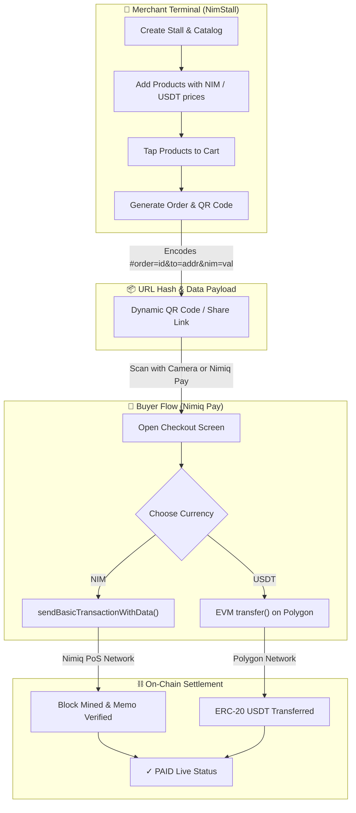

<div align="center">


# NimStall ⬢

### **Decentralized Point-of-Sale (POS) Mini App for Nimiq Pay**
*Accept Instant, Zero-Fee Crypto Payments with Nimiq & Polygon Rails.*

[](https://nimiq.dev/mini-apps)
[](https://vuejs.org/)
[](https://www.typescriptlang.org/)
[](https://vitejs.dev/)
[](https://polygon.technology/)
[](LICENSE)

<br/>

[Permanent Live App](https://datwebguy.github.io/nimstall/) • [GitHub Actions CDN](https://github.com/Datwebguy/nimstall/actions) • [How It Works](#-how-it-works) • [Merchant Guide](#-merchant-guide) • [Author](#-sole-contributor)

</div>

---

## 🌟 Overview

**NimStall** is a high-performance, non-custodial **Point-of-Sale (POS) Mini App** built natively for the **Nimiq Pay** ecosystem. 

Traditional payment systems charge **3% to 5% in swipe fees**, impose mandatory hardware lease contracts, hold merchant funds for days (T+2/T+5 settlement), and expose sellers to arbitrary chargebacks. 

**NimStall eliminates all middlemen:**
- ⚡ **Zero Platform Fees**: 100% peer-to-peer settlement directly to the merchant's wallet.
- 📱 **Zero Hardware Required**: Operates in any browser on any phone, tablet, or terminal.
- ⬢ **Dual-Rail Crypto Checkout**: Seamlessly accepts native **NIM** on the Nimiq blockchain and **USDT** on Polygon PoS.
- 🔒 **Privacy & Self-Custody**: Zero accounts, zero KYC, no central database. Merchant configuration and order histories are stored securely client-side in browser `localStorage`.
- 🔍 **Real On-Chain Verification**: Live block consensus polling verifies transaction hash validity before displaying verified receipts.

---

## 🚀 Key Features

| Feature | Description |
| **Frictionless "Pay to Order"** | Zero eager wallet popups on launch. Buyers browse freely and authorize payments on-demand only when clicking "Pay to Order". |
| **$0.10 Anti-Spam Stall Listing** | Merchants connect their account and pay a nominal $0.10 fee (in 0.10 USDT or ~1.5 NIM) to activate and verify their stall on-chain. |
| **Permanent Hosting** | Fully hosted on GitHub Pages CDN (`https://datwebguy.github.io/nimstall/`) with automatic zero-config builds. |
| **Live Nimiq Pay Integration** | Automatically binds to the merchant's Nimiq address via `@nimiq/mini-app-sdk` (`listAccounts()[0]`). |
| **Instant QR & Deep Links** | Generates dynamic `#order=...` QR codes encoding amounts, order ID memo, and item breakdowns. |
| **In-Place Item Editing** | Add, edit prices (NIM / USDT), update descriptions, and swap emoji icons in-place without deleting products. |
| **Dual-Currency Selection** | Buyers choose between micro-penny fee native **NIM** or dollar-pegged **USDT** on Polygon PoS. |
| **Consensus Polling** | Background polling engine verifies block inclusion on Nimiq mainnet nodes before marking orders as confirmed. |
| **Graceful Buyer View** | Dedicated fallback screen resolves unrecognized or expired order links with guidance. |
| **Landing & Showcase Hub** | Dedicated homepage featuring an interactive POS terminal simulator, story, step-by-step guides, and FAQ. |

---

## 🏗️ Architecture & Nimiq Involvement

NimStall operates as a client-side single-page application (SPA) designed to be loaded directly inside the **Nimiq Pay Mini App Browser** or any modern Web3 viewport.



### 1. Nimiq Mini App SDK Integration
NimStall initializes the official `@nimiq/mini-app-sdk`:
```ts
import { init } from '@nimiq/mini-app-sdk';

// 1. Initialize communication channel with Nimiq Pay shell
const provider = await init({ timeout: 10000 });

// 2. Automatically retrieve merchant NIM address
const accounts = await provider.listAccounts();
const merchantNimAddress = accounts[0]; // e.g., NQxx xxxx xxxx ...
```

### 2. Native NIM Payment Dispatch
When a customer confirms a NIM payment:
```ts
// 1 NIM = 100,000 Luna
const valueInLuna = Math.round(totalNim * 100000);

// Dispatches native payment modal inside Nimiq Pay with order memo
const txHash = await provider.sendBasicTransactionWithData({
  recipient: merchantNimAddress,
  value: valueInLuna,
  data: orderId, // Embedded on-chain memo for receipt reconciliation
});
```

### 3. Polygon USDT EVM Support
If the merchant accepts stablecoins, NimStall connects via the `window.ethereum` EVM provider injected by Nimiq Pay:
- Auto-switches chain to **Polygon PoS** (`0x89` / Chain ID 137).
- Encodes standard ERC-20 `transfer(address to, uint256 amount)` to `0xc2132D05D31c914a87C6611C10748AEb04B58e8F` (USDT 6 decimals).
- Confirms transaction hash on Polygon network.

---

## 📖 User Guides

### 👨‍💼 Merchant Guide: Setting Up & Selling
1. **Open NimStall in Nimiq Pay**: Navigate to *Mini Apps* inside Nimiq Pay and enter your NimStall URL.
2. **Auto-Detect Wallet**: Your NIM payout address is automatically pulled from your active Nimiq Pay wallet.
3. **Configure Catalog**: Go to **Stall Setup**. Enter your store name and add items with their NIM price (and optional USDT price). You can edit any item's price in-place at any time.
4. **Ring Up Orders**: On the **Sell & Cart** screen, tap products to add them to your cart.
5. **Generate Payment QR**: Tap **Checkout**. NimStall displays a high-resolution QR code with the exact order total and reference memo.
6. **Instant Verification**: When your customer confirms payment, the screen automatically updates to **✓ PAID** with the verified transaction hash.

---

### 🛍️ Customer Guide: Paying with Nimiq Pay
1. **Scan the QR Code**: Scan the merchant's checkout QR using Nimiq Pay's scanner or standard phone camera.
2. **Review Order**: View the order breakdown, stall name, and itemized receipt.
3. **Select Currency**:
   - Tap **⬢ NIM (Nimiq)** for instant zero-fee native transfer.
   - Tap **💵 USDT (Polygon)** for USD stablecoin transfer.
4. **Confirm Payment**: Tap the Pay button to authorize in Nimiq Pay. Once mined on-chain, your digital receipt is logged immediately.

---

## 💻 Developer Setup & Running Locally

### Prerequisites
- Node.js >= 18.x
- npm >= 9.x
- Nimiq Pay installed on your mobile device ([Google Play](https://play.google.com/store/apps/details?id=com.nimiq.pay) / [App Store](https://apps.apple.com/app/nimiq-pay/id6472288001))

### 1. Clone the Repository
```bash
git clone https://github.com/Datwebguy/nimstall.git
cd nimstall
```

### 2. Install Dependencies
```bash
npm install
```

### 3. Start Local Development Server
```bash
npm run dev -- --host
```
*Vite will bind to `http://localhost:5173` and your LAN IP (e.g. `http://192.168.1.x:5173`).*

### 4. Create Public Tunnel for Mobile Testing
To test inside your physical Nimiq Pay app on mobile:
```bash
npx cloudflared tunnel --protocol http2 --url http://127.0.0.1:5173
```
Copy the generated `https://*.trycloudflare.com` URL into **Nimiq Pay → Mini Apps**.

### 5. Production Build
```bash
npm run build
```
Generates production-optimized assets in the `dist/` directory in under 500ms.

---

## 📂 Project Structure

```
nimstall/
├── public/
│   ├── favicon.png             # Electric royal blue brand favicon
│   └── logo.png                # High-res NimStall brand mark
├── src/
│   ├── components/
│   │   ├── BuyerOrderNotFound.vue # Graceful invalid/expired order resolution
│   │   ├── CreateStall.vue     # Merchant stall & in-place catalog editor
│   │   ├── LandingPage.vue     # Showcase homepage, hero mockup & FAQ
│   │   ├── Navbar.vue          # Pill navigation tabs & live wallet pill
│   │   ├── OrderCheckout.vue   # QR code generation, payment & verification
│   │   ├── OrdersList.vue      # Local order history & receipt table
│   │   └── SellCart.vue        # Cashier catalog & shopping cart
│   ├── nimiq.ts                # Mini App SDK hooks, RPC polling, Polygon EVM
│   ├── storage.ts              # LocalStorage contracts for stalls & orders
│   ├── types.ts                # TypeScript data interfaces & ScreenType
│   ├── utils.ts                # Luna/NIM/USDT formatters & address utilities
│   ├── App.vue                 # Hash router & application shell
│   ├── main.ts                 # Vue application mount
│   └── style.css               # Design tokens, typography & animations
├── index.html                  # HTML entry point
├── package.json                # Project scripts & dependencies
├── tsconfig.json               # TypeScript configuration
└── vite.config.ts              # Vite server & allowedHosts configuration
```

---

## 👤 Sole Contributor

Developed and maintained exclusively by:

**Datwebguy**  
- **GitHub**: [@Datwebguy](https://github.com/Datwebguy)
- **Repository**: [https://github.com/Datwebguy/nimstall](https://github.com/Datwebguy/nimstall)

---

## 📜 License

This project is licensed under the **MIT License** - see the [LICENSE](LICENSE) file for details.
