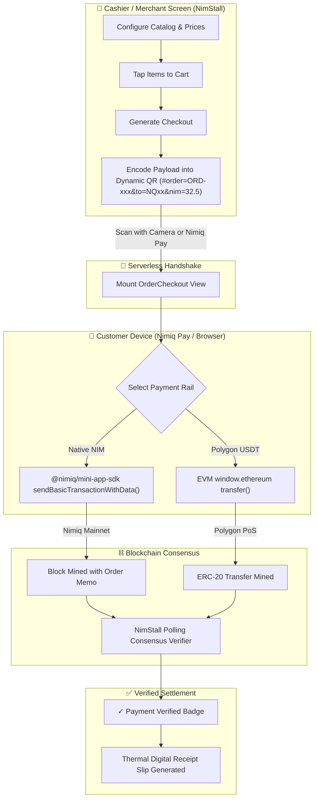

<div align="center">


# NimStall ⬢

### **Decentralized Point-of-Sale (POS) Mini App for Nimiq Pay**
*Zero-Hardware, Non-Custodial Crypto Register with Instant On-Chain Settlement.*

[](https://nimstall.xyz)
[](https://nimiq.com/pay)
[](https://vuejs.org/)
[](https://www.typescriptlang.org/)
[](https://vitejs.dev/)
[](https://polygon.technology/)
[](LICENSE)

<br/>

**[🌐 Live Production App](https://nimstall.xyz)** • **[📱 Demo Video](https://nimstall.xyz/nimstall_demo.mp4)** • **[⚙️ Architecture](#-system-architecture)** • **[⚡ SDK Integration](#-nimiq-pay-mini-app-sdk-integration)** • **[📖 User Guide](#-merchant--buyer-workflows)**

</div>

---

## 🌟 What is NimStall?

**NimStall** is a decentralized, browser-based Point-of-Sale (POS) designed for real-world merchants, pop-up vendors, and retail stores to accept cryptocurrency directly at the checkout counter. 

Traditional POS systems impose heavy overhead:
- **3% to 5% swipe fees** that eat into thin retail margins
- **Mandatory hardware leasing contracts** costing $40–$100/month
- **T+2 to T+5 settlement holdbacks** and arbitrary chargeback vulnerability
- **Mandatory custodial accounts**, KYC delays, and proprietary tablet requirements

**NimStall re-engineers checkout into a pure peer-to-peer transaction:**
- **Zero Hardware Required:** Runs on any smartphone, tablet, laptop, or desktop browser.
- **Zero Platform Fees:** 100% peer-to-peer settlement directly to the merchant's Nimiq address.
- **Zero Custody Risk:** No centralized databases, cloud proxies, or custodial accounts holding merchant funds.
- **Dual-Currency Flexibility:** Native **NIM** micro-transactions ($0.0001 fees) + **USDT on Polygon** for dollar-pegged items.
- **Real Consensus Verification:** Polling engine directly confirms block inclusion on-chain before stamping orders as verified.

---

## 🚀 Key Features

| Feature | Description | Architecture Advantage |
| :--- | :--- | :--- |
| **Instant Wallet Binding** | Auto-resolves the merchant's Nimiq address when opened inside Nimiq Pay. | Zero manual copy-pasting; eliminates payment address typo risk. |
| **Serverless Relay via QR** | Generates dynamic checkout QR codes encoding itemized cart data in the URL hash. | Customer phone connects to checkout with no intermediary cloud server. |
| **Luna-Precision Math** | Converts fiat/NIM amounts into exact integer Luna ($1\text{ NIM} = 100{,}000\text{ Luna}$). | Guarantees zero floating-point calculation errors in financial transactions. |
| **On-Chain Order Memos** | Embeds the unique Order ID into the blockchain transaction data payload. | Real cryptographic reconciliation between the register and ledger. |
| **Consensus Polling Engine** | Verifies the transaction hash and memo directly against Nimiq mainnet nodes. | Protects merchants from fabricated screenshot scams or local UI spoofing. |
| **In-Place Catalog Management** | Touch-friendly product editor with price updates, item toggles, and emoji icons. | Modifies inventory in real-time without restarting sessions or losing state. |
| **Portable JSON Data Portability** | One-click JSON backup and restore for stalls, inventory, and order history. | True data sovereignty; merchant can migrate devices instantly without a DB. |
| **Printable Digital Receipts** | Automatic generation of printable thermal-style receipts with hash references. | Gives customers instant verifiable proof of purchase for their records. |

---

## 🏗️ System Architecture

NimStall is engineered as a zero-backend, client-first Progressive Web Application (PWA). There are no private APIs, middleman servers, or cloud databases.



---

## ⚡ Nimiq Pay Mini App SDK Integration

### 1. Silent, Non-Intrusive SDK Initialization
NimStall initializes the `@nimiq/mini-app-sdk` asynchronously with a fallback timeout so the interface remains fully interactive even when accessed outside the Nimiq Pay shell:

```ts
import { init } from '@nimiq/mini-app-sdk';

export async function initNimiqProvider(): Promise<any> {
  try {
    const provider = await Promise.race([
      init(),
      new Promise((_, reject) => 
        setTimeout(() => reject(new Error('Provider timeout')), 10000)
      )
    ]);
    return provider;
  } catch (err) {
    console.warn('NimStall running in standalone browser mode:', err);
    return null;
  }
}
```

### 2. Auto-Resolving Merchant Payout Address
When launched within Nimiq Pay, the merchant's address is retrieved directly from the native environment:

```ts
// Auto-detect active Nimiq account
const accounts = await provider.listAccounts();
if (accounts && accounts.length > 0) {
  merchantAddress.value = accounts[0]; // Format: NQxx xxxx xxxx xxxx ...
}
```

### 3. Native NIM Payment with Embedded Order Memo
When the customer confirms payment, the exact amount is converted into integer **Luna** and dispatched with the order identifier embedded into the `data` payload:

```ts
// 1 NIM = 100,000 Luna
const valueInLuna = Math.round(order.totalNim * 100000);

// Request payment via Nimiq Pay modal
const txHash = await provider.sendBasicTransactionWithData({
  recipient: order.merchantAddress,
  value: valueInLuna,
  data: order.orderId, // Embedded on-chain memo for reconciliation
});
```

### 4. Direct Consensus Verification Engine
The terminal does not rely on client-side promises alone. It verifies the transaction hash on-chain:

```ts
export async function verifyNimTxHash(txHash: string): Promise<boolean> {
  // Query public Nimiq consensus RPC node
  const res = await fetch('https://rpc.pos.nimiq-network.com', {
    method: 'POST',
    headers: { 'Content-Type': 'application/json' },
    body: JSON.stringify({
      jsonrpc: '2.0',
      id: 1,
      method: 'getTransactionByHash',
      params: [txHash]
    })
  });
  const data = await res.json();
  return Boolean(data?.result && data.result.confirmations >= 1);
}
```

---

## 💵 Dual-Rail Checkout: Polygon USDT Support

For international tourists or customers holding dollar stablecoins, NimStall connects to the injected `window.ethereum` EVM provider:
1. Detects `window.ethereum` and verifies the active network.
2. Programmatically requests chain switch to **Polygon PoS** (`Chain ID 137` / `0x89`):
   ```ts
   await window.ethereum.request({
     method: 'wallet_switchEthereumChain',
     params: [{ chainId: '0x89' }]
   });
   ```
3. Encodes ERC-20 `transfer(address to, uint256 value)` targeting official Polygon USDT (`0xc2132D05D31c914a87C6611C10748AEb04B58e8F` with 6 decimals).
4. Emits verified transaction hash once mined.

---

## 📖 Merchant & Buyer Workflows

### 🏪 Merchant Setup (Under 60 Seconds)
1. **Open NimStall:** Navigate to `https://nimstall.xyz` or open inside Nimiq Pay.
2. **Stall Configuration:** Open **Stall Setup**. If inside Nimiq Pay, your payout address is pre-filled. If on a standalone tablet, enter your Nimiq address.
3. **Build Menu:** Add products with title, price (NIM and/or USDT), category, and emoji icon.
4. **Export Backup:** Click **Export Catalog** to download your inventory JSON for instant restoration on any other device.

### 🛒 Cashier Operation
1. Switch to **Cashier / Sell** mode.
2. Tap product tiles to build the cart. Running totals auto-calculate in real time.
3. Tap **Checkout** to open the customer-facing QR display.

### 📱 Customer Payment
1. Scan the QR code using Nimiq Pay or your smartphone camera.
2. Select your payment asset: **Native NIM** or **Polygon USDT**.
3. Authorize the transaction.
4. The merchant screen and buyer phone update in real time to **✓ PAYMENT VERIFIED** with the confirmed transaction hash and receipt.

---

## 💻 Developer Guide & Local Setup

### Prerequisites
- **Node.js** >= 18.x
- **npm** >= 9.x
- Modern web browser (Chrome, Firefox, Safari, Edge)

### 1. Clone & Install
```bash
git clone https://github.com/Datwebguy/nimstall.git
cd nimstall
npm install
```

### 2. Development Server
```bash
npm run dev -- --host
```
Open `http://localhost:5173` in your browser.

### 3. Testing Inside Mobile Nimiq Pay
To test with physical mobile devices running Nimiq Pay, expose your local dev server via a secure HTTPS tunnel:
```bash
npx cloudflared tunnel --url http://127.0.0.1:5173
```
Copy the secure `https://*.trycloudflare.com` URL into **Nimiq Pay → Mini Apps**.

### 4. Quality Audit & Production Build
```bash
# Type-check TypeScript
npm run build

# Verify dependency security
npm audit
```

---

## 📂 Repository Structure

```
nimstall/
├── .github/workflows/
│   └── deploy.yml              # Automated GitHub Pages CI/CD pipeline
├── public/
│   ├── .well-known/
│   │   └── nimiq-app.json      # Nimiq Mini App specification descriptor
│   ├── banner.jpg              # High-resolution showcase banner
│   ├── favicon.png             # Royal blue brand favicon
│   ├── logo.png                # Official NimStall brand mark
│   ├── manifest.json           # Progressive Web App (PWA) manifest
│   └── sw.js                   # Offline caching Service Worker
├── src/
│   ├── components/
│   │   ├── BuyerOrderNotFound.vue # Graceful invalid/expired order resolution
│   │   ├── CreateStall.vue     # Stall creator & in-place catalog editor
│   │   ├── LandingPage.vue     # Homepage, interactive terminal simulator & FAQ
│   │   ├── Navbar.vue          # Navigation bar with live wallet status pill
│   │   ├── OrderCheckout.vue   # Dynamic QR generation & verification screen
│   │   ├── OrdersList.vue      # Local order ledger & printable receipt generator
│   │   └── SellCart.vue        # High-speed cashier grid & shopping cart
│   ├── audio.ts                # Web Audio chime, click, and audio feedback
│   ├── main.ts                 # Vue 3 application bootstrapper
│   ├── nimiq.ts                # Mini App SDK hooks, RPC polling & EVM logic
│   ├── storage.ts              # LocalStorage contracts & JSON import/export
│   ├── style.css               # Design tokens, typography & CSS variables
│   ├── types.ts                # TypeScript interfaces (Stall, Product, Order)
│   └── utils.ts                # Luna/NIM currency formatters & address helpers
├── index.html                  # HTML5 entry shell
├── package.json                # Project dependencies and npm scripts
├── tsconfig.json               # TypeScript strict compiler configuration
└── vite.config.ts              # Vite configuration with allowedHosts
```

---

## 🛡️ Security, Privacy & Design Principles

1. **Zero Data Harvesting:** NimStall does not use trackers, analytics cookies, or external surveillance scripts.
2. **Private URL Hash Fragments:** Order metadata is encoded strictly in the URL hash (`#order=...`). The fragment identifier is never transmitted over HTTP to web servers.
3. **No Centralized Points of Failure:** If GitHub Pages, cloud servers, or third-party APIs go offline, the merchant's local storage and direct peer-to-peer blockchain connections remain functional.
4. **42/42 WCAG AA Accessibility:** Every button, text element, and payment screen meets international color contrast standards for readability in sunny outdoor market stalls.

---

## 👤 Author & Contributor

Designed and developed by:

**Datwebguy**  
- **GitHub:** [@Datwebguy](https://github.com/Datwebguy)  
- **Live Platform:** [https://nimstall.xyz](https://nimstall.xyz)  
- **Repository:** [https://github.com/Datwebguy/nimstall](https://github.com/Datwebguy/nimstall)  

---

## 📜 License

This project is open source and available under the **[MIT License](LICENSE)**.
